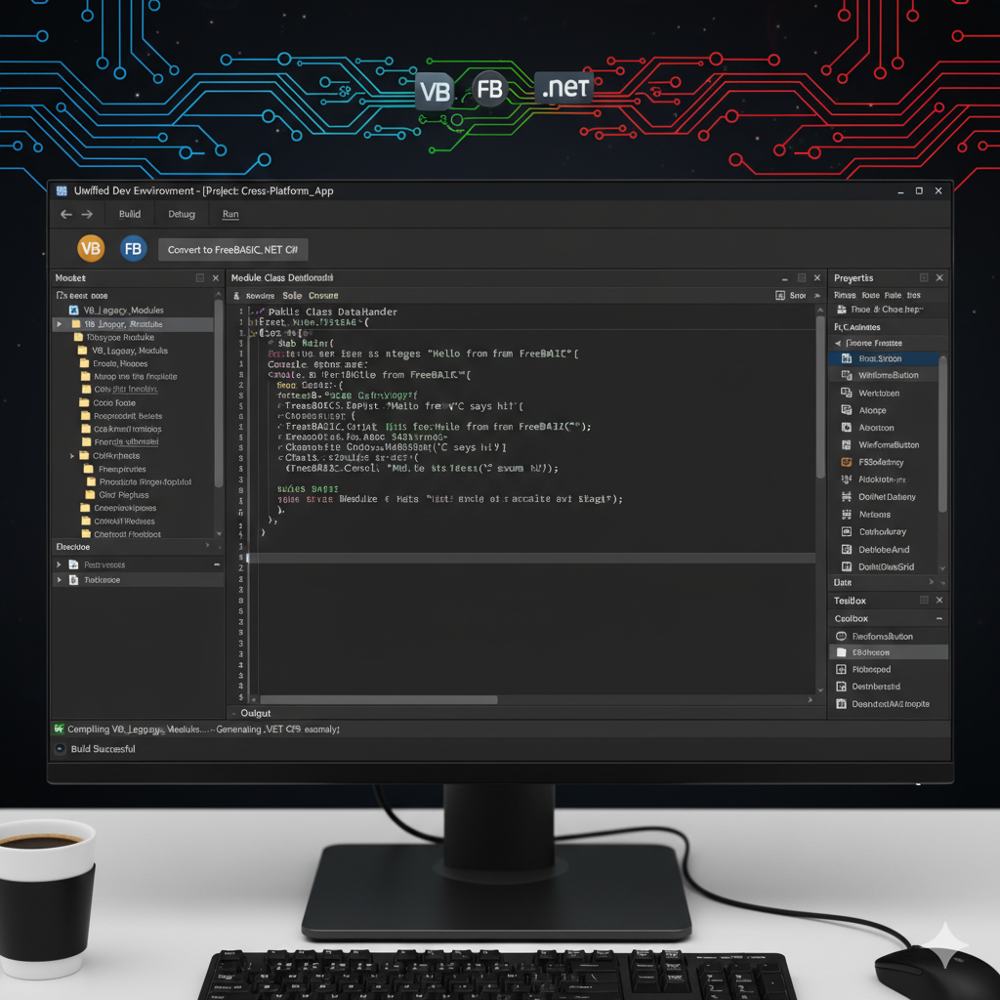

# Roslyn Analyzers Sample

A set of three sample projects that includes Roslyn analyzers with code fix providers. Enjoy this template to learn from and modify analyzers for your own needs.

____
## Content
### cirydwib
A .NET Standard project with implementations of sample analyzers and code fix providers.
**You must build this project to see the results (warnings) in the IDE.**

- [SampleSemanticAnalyzer.cs](./cirydwib/cirydwib/cirydwib/SampleSemanticAnalyzer.cs): An analyzer that reports invalid values used for the `speed` parameter of the `SetSpeed` function.
- [SampleSyntaxAnalyzer.cs](./cirydwib/cirydwib/cirydwib/SampleSyntaxAnalyzer.cs): An analyzer that reports the company name used in class definitions.
- [SampleCodeFixProvider.cs](./cirydwib/cirydwib/cirydwib/SampleCodeFixProvider.cs): A code fix that renames classes with company name in their definition. The fix is linked to [SampleSyntaxAnalyzer.cs](./cirydwib/cirydwib/cirydwib/SampleSyntaxAnalyzer.cs).

### cirydwib.Sample
A project that references the sample analyzers. Note the parameters of `ProjectReference` in [cirydwib.Sample.csproj](../cirydwib.Sample/cirydwib.Sample.csproj), they make sure that the project is referenced as a set of analyzers. 

### cirydwib.Tests
Unit tests for the sample analyzers and code fix provider. The easiest way to develop language-related features is to start with unit tests.

## How To?
### How to debug?
- Use the [launchSettings.json](./cirydwib/cirydwib/cirydwib/Properties/launchSettings.json) profile.
- Debug tests.

### How can I determine which syntax nodes I should expect?
Consider using the Roslyn Visualizer toolwindow, witch allow you to observe syntax tree.

### Learn more about wiring analyzers
The complete set of information is available at [roslyn github repo wiki](https://github.com/dotnet/roslyn/blob/main/docs/wiki/README.md).
